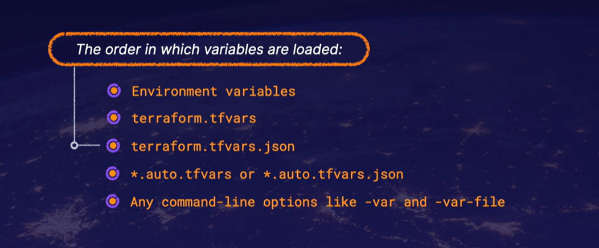

# Basic commands
terreform version
terraform -chdir=<path_to/tf> <subcommand> # Switch to working directory
terraform init
terraform plan
    terraform plan -out <plan_name> # output a deployment plan
    terraform plan -destroy # output a destroy plan
terraform apply
    terraform apply <plan_name> # apply a specific plan
    terraform apply -var my_variable=<variable> #Pass a variable via the command line
terraform destroy
terraform providers # Get provider info used in configuration

### Example block
resource "aws_vpc" "main" {
    cidr_block = var.base_cidr_block
}

<BLOCK TYPE> "<BLOCK LABEL>" "<BLOCK LABEL>" {
    #Block Body
    <IDENTIFIER> = <EXPRESSION> #Argument (Assigne a value to a name)
    #Expression respresent a value
}

### File extension
.tf
.tf.json

### Text encodeing
UTF-8

# Directories and Modeules
Modeuls are a collection of .tf and or .tf.json files kept together in a directory. A module consistes of only the top-level config files in the directory. A nested directory is treated as a seperate module and may not be automatically included. 

### Root Module
Terraform configuration consistes of a root module and a few child modules. The root module is the working directory where Terraform is invoked.

### Resources
Resources are the most important part of the Terraform language. Resource blocks describe infrustructure objects like virtual networks, computer instance, or components like DNS records.

#### Resource Types:
- Providers
- Arguments
- Documentation

### Meta Arguments
depends_on
count
for_each
provider
lifecycle
provisioner and connection

### Operation Timeout
There are some resource types that provide special timeouts, nested block arguments that allow for customization of how long certain operations are allowed to take before they are deemed failed.

### How configuration is applied
- Create
- Destroy
- Update in-place
- Destroy and re-create

### Input Variables
The name of a variable can be any valid identifier except for source, version, providers, count, for_each, lifecycle, depends_on and locals
These are reserved KWs

#### Optional Arguments for variable
default (makes the variable optional)
type (acceptable type)
description (input variable doc)
validation (validation rules in addition to type constraints)
sensetive (Limits the terraform UI output)

#### Type Constraints
string
number
bool

#### Type Constructors
list(<type>)
set(<type>)
map(<type>)
object({<attribute> = <type>, ...})
tuple([<type>, ...])

Value can be accessed from an expression, such as var.<var_name>.

a value assigned to a variable can only be accessed in an expression within the module it was declared

input_variable_order

### Output Variabls
- A child module can use them to expose a subset of resource attributes to the parent module.
- A root module can use them to print values in the CLI
- Root module outputs can be accessed by other configurations via the terraform_remote_state data source

optional Arguments for variable Declaration
- description
- sensetive
- depends_on

### Local variables
Local values are like a function's temporary local variables

when a local value is declared, you can reference to it in expressions as local.<name>.

Local values can only be accessed in expressions within the module where they were declared.

## Modules
A module is a container for multiple resources that are used together.
A module can consist of a collection of .tf as well as .tf.json files kept together in a directory.

Three types of modules
- Root Modules - You need at least one root module.
- Child Modules - Modules that are called by the root module.
- Published Modules - Modules loaded from a private or public registry.

example
module "servers" {
    source = "./app-cluster"
    
    servers = 5
}

Here a root module that includes a module block is calling a child module. The label after the module keyword is a local name that can be used to refer to the module.

4 Module Argument Types

1. The source argument is required for all modules.
2. The version argument is recommended for modules from a registry.
3. The input variable arguments.
4. The meta-arguments like 
    - for_each
    - depends_on
    - count
    - providers
    - lifecycle (planned)

Calling module cannot access child module attributes directly. 
Child modules can declare output values to selectively export values which are accessible by the calling modules.

When you split code into other child modules, or when moving resource blocks between modules, you can cause Terraform to see the new location of the module block as an entirely different resource. Use the 
terraofrm state mv
command to inform Terraform that the child module block has moved to a different module.

### Taint 
The Terraform Taint command allows you to manually flag a resource as tainted, which means it will be destroyed and recreated on the next terraform apply. Terraform untaint allows you to remove that tainted condition from the resource.

The taint command can be used to taint specific resources within a module.

example
terraoform taint module.salt_master.aws_instance.salt_master

It is not possible to taint an entire module. Instead, each resource within the module must be tainted seperately.

### module source type
8 types
- Local Paths
- Terraform Registry
- GitHub
- Bitbucket
- Generic Git, Mercurial repositories
- HTTP URLs
- S3 buckets
- GCS buckets

### Difference between Expressions and Functions
Expressions are used to reference / compute values within a configuration

Functions are used to transform and combine values within expressions

Expressions
The simplest expressions are literal values, like ACG or 1, but the Terraform language also allows more complex expressions, such as references to data exported by resources and a number of built-in functions.
### 7 type values
- string
- number
- bool
- list/tuple
- map/object
- null
### 7 Types of named values available in Terraform
- Resources
- Input Variables
- Local Values
- Child Module Outputs
- Data Sources
- Filesystem and workspace info
- Block-local Values

### Conditional expressions
condition ? True_val : False_val

